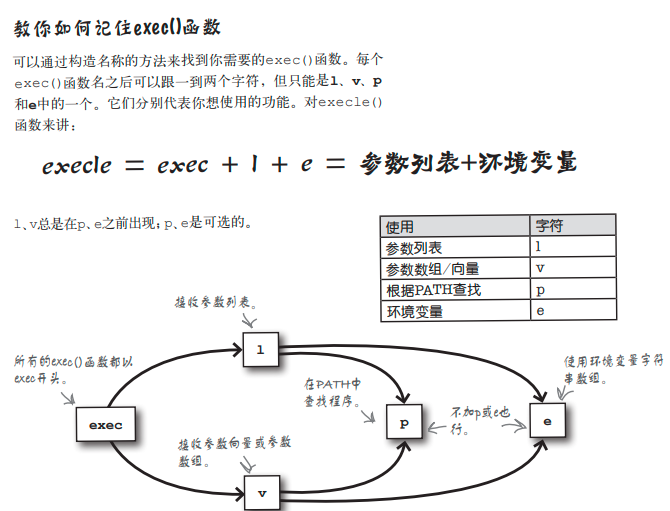

## 普通warning
### 中文乱码改变方式
chcp 65001

### const pointer && point to const

const char*, char const*, char*const的区别问题几乎是C++面试中每次都会有的题目。

事实上这个概念谁都有只是三种声明方式非常相似很容易记混。
Bjarne在他的The C++ Programming Language里面给出过一个助记的方法：
把一个声明从右向左读。

char  * const cp; ( * 读成 pointer to )
cp is a const pointer to char

const char * p;
p is a pointer to const char;

char const * p;
同上因为C++里面没有const*的运算符，所以const只能属于前面的类型。

### EOF
EOF 本来表示文件末尾，意味着读取结束，但是很多函数读取错误时也返回EOF，
那么当返回EOF时，到底是文件读取完毕了还是读取错误了？可以借助stdio.h中的两个函数判断。

### 字符与字符数组
字符的索引值是个偏移量，计算机在存储器中以`连续字节`的形式保存字符，并用索引计算字符在存储器中的位置。
那么，就是说，当时设计的时候，计算机并不清楚字符串的长度。

那么，结尾处就得加上一个NUL ，在ASCII码中叫做 \0(哨兵),来表明其结尾。
- 双引号定义的字符串又叫做字符串字面量(string literal)
- 字符串字面量是常量；
- 所处位置也不同？

### 联合
```c
#include <stdio.h>
typedef union{
    short count;
    float weight;
    float volume;
}  quantity;
// C89表示法只能设置第一个字段
int main(){
    // C89方式
    quantity q = {4};
    // 指定初始化器(designated initializer),这个也可以设计struct的值
    quantity q = {.weight=1.5};
    // 点表示法
    quantity q;
    q.volume = 3.7;
    return 0;
}

```
无论用哪种方法设置联合的值，都会保存一条数据。联合只是提供了方法。

### C语言的堆
C语言非常古老，发明它的时候，绝大多数语言都没有自动“垃圾回收”装置
-   使用strup()函数会调用malloc()函数吗？
    -   这个取决于C标准库是如何实现的，通常情况下，是这样的。
操作系统会在程序(进程)结束时清除所有存储器。

### C的指针
函数名可以引用某段代码,引用存储器中的某样东西.
在C语言中,函数名也是指针变量

由于 B 语言(C语言的前身NB),的地址以 word 为单位，所以对指针（单纯表示地址的
整数）加 1，指针就会自动指向数组的下一个元素。为了继承这一点，C
语言里引入了“对指针加 1，则指针前进该指针所指向的类型的长度”这一
规则。

C 语言中存在指针运算的另一个原因是，以前使用指针运算能够写出更
高效的程序。


-   指针的声明有多种方式
    -   但是C语言没有函数类型,因为函数的类型不止一种.
    -   eg. int functionname(type arguments)
    -   调用:
        -   返回类型 (* 指针变量 )( 参数类型 )
由此可以推知函数指针的表示方法更复杂
-   由于是函数指针,调用函数时可以加*
    -   即调用时,match(ADS[i])换成(*match(ADS[i]))也行.

函数指针数组,一种更复杂的表示方式:
-   replies[] = {dump, second_chance, marriage};
    -   void (*replies[])(response) = {dump, second_chance, marriage};

#### C 语言曾是只能使用标量的语言
对于标量（scalar）这个词，大家可能有些陌生。
简单地说，标量指的就是 char、int、double、枚举型等算术类型以
及指针。相对地，像数组、结构体和联合体这样由多个标量组合而成的类
型，我们称为聚合类型（aggregate）。
早期的 C 语言能够一起处理的只有标量

### 标准头文件目录
通常类UNIX操作系统(如Mac或Linux)中，编译器会在以下目录查找头文件：
/usr/local/include
/usr/include

如果是MinGW的gcc,编译器会在下面这个目录中查找:
C:\MinGW\include

#### 共享.h头文件
1.  将头文件复制到/usr/local/include这样的标准目录中，就可以在源代码中用尖括号使用
    -   #include <encrypt.h>
2.  在include语句中使用完整语句路径名。
    -   #include "/my_header_files/encrypt.h"
3.  告诉编译器去哪里找头文件。
    -   可以使用gcc的-I选项
    -   gcc -I/my_header_files test_code ... -o test_code

### 动态库
绝大部分操作系统都支持动态库
gcc -shared hfcal.o -o

-shared选项告诉gcc你想把.o目标文件转化为动态库。编译
器创建动态库时会把库的名字保存在文件中，假设你在Linux
中创建了一个叫libhfcal.so的库，那么libhfcal.so文件就会记住它的库名叫hfcal。也就是说，一旦你用某个名字编译了库，就不能再修改文件名了，这一点很重要。
若想重命名库，就必须用新的名字重新编译一次。
- windows的MinGW
  - C:\libs\hfcal.dll
-   windows的Cygwin
    -  /libs/libhfcal.dll.a
-    Linux或Unix
    -  /libs/libhfcal.so
-  Mac
   -  /libs/libhfcal.dylib

#### Linux动态库的使用
但Linux就不一样了。
在Linux和大部分Unix中，编译器只会记录libhfcal.so库的文件名，
而不会包含路径名。也就是说如果不把hfcal库保存到标准目录（如
/usr/lib），程序就找不到它。为了解决这个问题，Linux会检查保
存在LD_LIBR ARY_PATH变量中的附加目录。只要把库目录添加
到LD_LIBRARY_PATH中，并export①它，elliptical就能找到
libhfcal.so

是不是有点复杂？是的，这就是为什么绝大部分使用动态库的程序
要把动态库保存在标准目录下。在Linux和Mac中，动态库通常保存
在/usr/lib或/usr/local/lib中；而在Windows中，程序员通常把.DLL和
可执行文件保存在同一个目录下。

### 系统调用
进程是存储器中运行的程序。如果在Windows中输入
taskmgr，或在Linux或Mac上面输入ps –ef，就可以看
到系统中运行的进程。操作系统用一个数字来标识进程，
它叫**进程标识符（process identifier，简称PID）**。

exec()函数通过运行其他程序来替换当前进程。你可以告诉exec()函数要使用哪些命令行参数和环境变量。新程序启动后PID和老程序一样，就像两个程序接力跑，你的程序把进程交接给了新程序。




### 系统调用返回值

但仅仅告诉用户系统调用失败与否是不够的，通常你想
知道系统调用为什么失败，因此几乎所有系统调用都遵
循“失败黄金法则”。

- 尽可能收拾残局。
- 把errno变量设为错误码。
- 返回 -1。

## 奇妙的C语言
在 C 语言中，用来保存变量的内存上的空间叫作对象（object），而被
保存为对象的数据类型（比如 int、double）叫作对象类型（object 
type）*

C 语言的声明语法本来就是不自然、奇怪而又变态的。

这种“差 1 错误”的问题在编程中经常发生。因此，普遍认为在一般
情况下如果以 0 为基准编号，那么通常（并不是所有）能回避这类问题。

实际上，不论有没有 []，在表达式中，数组都会被解读成指向其初始
元素的指针。

-   也就是说，当你想着“指针太难了，我还是老老实实地用数组吧”，
    并像下面这样声明数组，然后通过 array[i] 访问时，你就已经在使用指
针了
```c
int array[5];
```


#### 解读 C 语言声明
1. 先看标识符（变量名或函数名）。
2. 从贴近标识符的地方开始，按照如下优先级解释派生类型（指针、数组、函数）：
① 用于整合声明的括号；
② 表示数组的 []、表示函数的 ()；
③ 表示指针的 *。
3.  完成对派生类型的解释之后，通过 of、to 或 returning 连接句子。
4.  添加类型修饰符（位于左侧，比如 int、double）。
5.  如果不擅长英语，可以用中文解释。


#### 语法糖（syntax sugar 或 syntactic sugar）
由于 p[i] 是 \*(p + i) 的简便写法，所以实际上就算没有 [] 这
样的运算符也没关系。至少对编译器来说是这样的。
然而，对于人类来说，\*(p + i) 这样的写法既难以阅读，写起来
也（增加了打字量）很麻烦。于是（仅仅）为了让人类易于理解，C 语
言引入了 [] 运算符。

在表达式中，
虽然有些违背常理，但下标运算符 [] 的确与数组毫无关系，至少在语
法上是这样的。

#### 可边长参数
之所以采用从后往前压栈的方式，其实是为了实现可变长参数。

